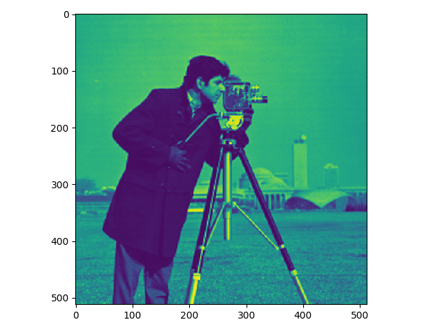

# Sobel_horizontal filter
_Author: yuzhe JIE_
_Last update: 18/10/2019_

## Description
The sobel_h filter detects and emphase the horizontal edges of 
an image, using the Sobel transform. In my algorithm, sobel_h filter
only applied to the whole image (every pixel), it does not provide
masks to protect some fixels (keep them original)

## How it works
sobel_h filter computes an approximation of the gradient of the image
intensity function. It uses a 3x3 kernal [[1, 2, 1],[0, 0, 0],[-1, -2, -1]]
to do convolution operation with the initial image to calculate the approximations of the
derivatives in the horizontal direction. In my algorithm a conv2d 
function was used to do the convolution. The result is a edge map 
highlighting the horizontal edges.

## Original Figure


## Result Figure


## Dependencies
The function tf_sobel_h, it does not use any dependencies
except tensorflow. However in test driver the resulting 
tensor of tf_sobel_h is converted to a numpy array to do 
the outlier masking. That sets dark values to the outlier
and make the effect more observable.

## How to use 
User can call tf_sobel_h method and pass image matrix. This 
function returns a tensor containing the edge map of the image
User can ignore the outlier masking part as that will not make 
huge difference, but they do need to convert to numpy array 
useing something like eval() if they want to visulize immediately.

```
result = tf_sobel_h(image)
plt.imshow(result.eval(), cmap=plt.cm.gray)
plt.show()
```

